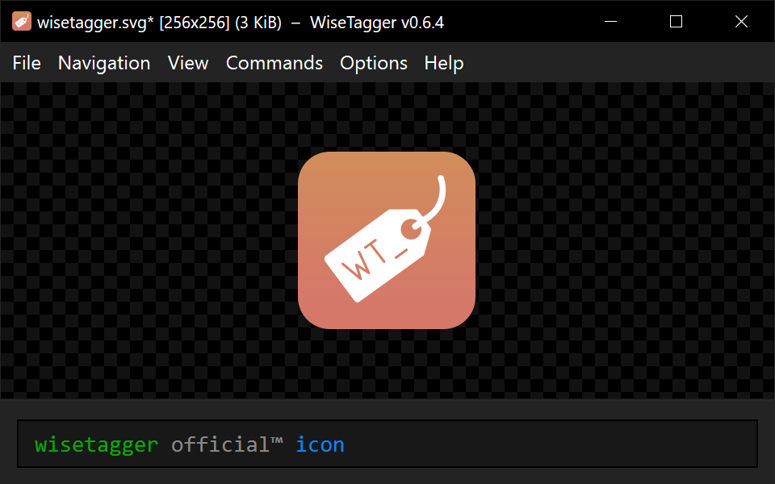

# WiseTagger #
Simple picture tagging tool

[](https://wolfgirl.org/software/wisetagger/documentation)
[](https://github.com/0xb8/WiseTagger/releases)


<p align="center">
	
</p>


## Features ##
* Tag autocomplete
* Tag implication, replacement and autoremoval
* Visual tag classification, custom tag colors and categories
* Fetch tags from several imageboards
* Filter the queue by one or several tags
* Filesystem-based tag file selection
* Video playback
* Image reverse-search (using iqdb.org)
* Instant switching between previous and next images in queue
* Custom commands
* Crossplatform, using Qt5 Framework

### Tag File Syntax ###
WiseTagger uses simple text files containing tags for autocomplete suggestions.

Each tag must be placed on separate line and contain only letters, numbers and limited punctuation (not including quotes, commas, dash and equal signs).
All whitespace is ignored.

If disallowed character is found, it will be ignored with the rest of the line.

```
# These tags will be presented in autocomplete sugestions as needed, 
# with their relative order preserved.
maid
nekomimi  # cat ears #dd00dd
ponytail  # #green
pout
smile
sad
3d_cg     # tags can start with numbers

# A comment after the tag will be displayed in autocomplete suggestion for that tag.
# Custom color for the tag can be specified via hex color code anywhere in the comment:
#     some_tag  # comment text #ffa804 more text
#     some_tag  # or using named colors: #blue
# Comments on separate lines (such as this one) are completely ignored.

# Tag 'tagme' will be automatically removed.
# To keep this tag just type it again.
# This tag will NOT be suggested in autocomplete.
-tagme  # you can also use unicode not sign: ¬


# Tag replacement: 'megane' will be automatically replaced with 'glasses'.
# To keep the original tag just type it again.
# Tag 'megane' will NOT be suggested in autocomplete.
glasses = megane    # you can also use unicode arrows: ←, ⇐, ⇚, ⟵, ⟸


# Tag implication: 'nekomimi' will be automatically added when 'catgirl' is added.
# Consequent tag can be erased - it will not be addded again.
# Tag 'nekomimi' will NOT be suggested in autocomplete.
catgirl : nekomimi  # you can also use unicode arrows: →, ⇒, ⇛, ⟶, ⟹

# Implication allows to remove consequent tags when their antecedent tag is present:
high_resolution → -low_resolution, ¬medium_resolution

# Replace and imply tags simultaneously. Order does not matter.
catgirl ⇐ animal_ears → nekomimi

# Comma-separated lists may also be used with tag replacement and implication.
some_tag ⇐ first_replaced_tag, second_replaced_tag → first_implied_tag, second_implied_tag

# It is allowed to define the same tag several times.
# Replaced, implied tags, and comments will be merged correspondingly with 
# previous definitions of 'some_tag'.
some_tag ⇐ third_replaced_tag → thirt_implied_tag

# All these tags will be removed.
¬ one, two, three

# ----- ADVANCED FEATURES -----

# Modify default colors of tag kinds using #pragma:
#pragma replaced_color #ff8800
#pragma implied_color #0088ff
#pragma removed_color #ff0000

# Define custom category colors:
#pragma category artist #bbbb00
#pragma category character #00aa00
#pragma category copyright #dd00dd

# Then mention the category name in tag's comment to color it:
pablo_picasso                               # artist
dorothy_gale → the_wonderful_wizard_of_oz   # character
the_wonderful_wizard_of_oz                  # copyright
```

**Note:** tags will be presented in autocomplete suggestions in the same order they are in tags file!  
Use external tools or text editor features to sort tags in the tags file.

### Tag file selection ###
To use tag autocompletion place a *Normal Tag File* or *Override Tag File* in the directory with your pictures or in any of its parent directories.

* *Normal Tag File* - plain text file with suffix `.tags.txt` (e.g. `general.tags.txt`)  
   When several *normal* tag files are found, their contents are concatenated in the search order (see note 1 below).
* *Override Tag File* - plain text file with suffix `.tags!.txt` (e.g. `halt.tags!.txt`)  
  Similar to *normal* tag files, but when *override* tag file is found, the search does not proceed to parent directory.  
  All *override* tag files in one directory are still concatenated, just like *normal* tag files.

If both *normal* tag file and *override* tag file are found in one directory, the tag file conflict warning is displayed. To resolve the conflict, change the conflicting *normal* tag file into *override* tag file.
#### Notes:
1. Concatenation order of tag files within one directory is system-dependent. If strict ordering is desired, use zero-padded number prefix (e.g. `0001-general.tags.txt`). 
2. Tag file prefix can be omitted, keeping just *normal* or *override* tag file suffix: `.tags.txt` or `.tags!.txt`. Such files are treated as hidden in UNIX-like systems.


#### Tag file reloading ####

WiseTagger will automatically reload tag file(s) when the any of them are modified.

To detect newly created tag file(s) use *Navigation - Reload Tag File* menu command.

Current set of tag files can be opened in a text editor using *Navigation - Edit Tag File* menu command.

### Imageboard tag compaction ###
Some imageboard tags may be replaced with their shorter or longer versions.

For example, if *Options - Replace imageboard tags* is enabled, and `yande.re 12345` or `Konachan.com - 67890` tags are present, they will be replaced with `yandere_12345` and `konachan_67890` respectively.

Similarly, if *Options - Restore imageboard tags* is enabled, `konachan_67890` will be turned back to `Konachan.com - 67890`.

#### New tags detection ####

WiseTagger will detect tags that are added by user but are not present in any of the tag files.

After such tag had been used a few times, WiseTagger will display notification message with copyable list of new tags.

### Queue filtering

You can filter the queue using *Navigation - Set Queue Filter* (`Ctrl + Q`) menu command.

Filter query consists of one or more tags. Each tag must be present in the file name for it to pass the filter.

Plain tags (e.g. `tail`) are matched as substrings: `tail` will match `ponytail` or `tailor`.  
To match tags exactly, surround the query tag with quotes: `"tail"`. Quoted tags can also contain spaces.
